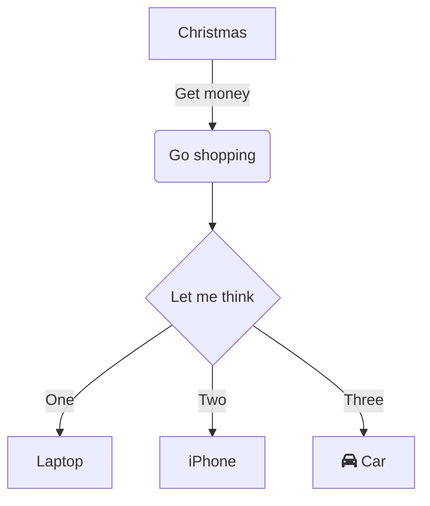

# Getting Started

## Install

```bash
npm install mui-color-input --save
```



or you can use **yarn**

```bash
yarn add mui-color-input
```

We have completed installing the package.

## Simple usage

Here is a simple usage for using the component:

```jsx
import React from 'react';
import { MuiColorInput } from 'mui-color-input';

const MyComponent = () => {
  const [color, setColor] = React.useState('#ffffff');

  const handleChange = (color) => {
    setColor(color);
  };

  return <MuiColorInput value={color} onChange={handleChange} />;
};
```

## Congratulations !

That's all, now let's deep dive into the [props](/docs/api-reference).
